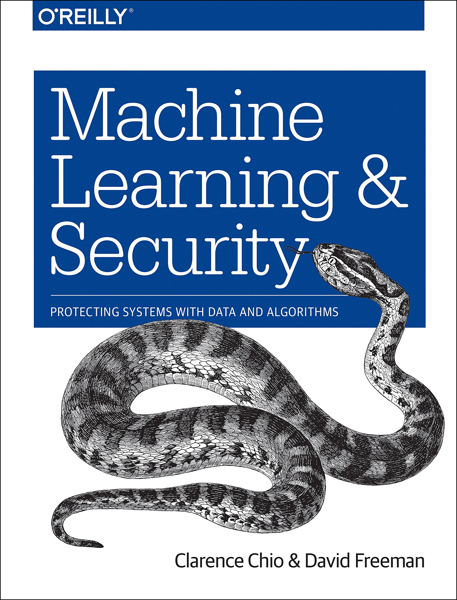

# Machine Learning and Security: Protecting Systems with Data and Algorithms
by Clarence Chio and‎ David Freeman (Authors), published by O'Reilly Media

[Visit Website](https://mlsec.net/) | [Purchase on Amazon](https://amzn.to/2FmVDYQ) | [Read on O'Reilly Safari](http://shop.oreilly.com/product/0636920065555.do)

This repository contains accompanying resources, exercises, datasets, and sample code for the Machine Learning and Security book released in Feb 2018.

## Dependencies

### System packages
* Python 3.6+
* Spark 2.2.0 (Pre-built for Apache Hadoop 2.7 and later)

### Python packages
* pandas 0.20.2
* matplotlib 2.1.0
* seaborn 0.8.1
* numpy 1.13.3
* scikit-learn 0.19.1
* nltk 3.2.5
* datasketch 1.2.5
* tensorflow 1.4.0
* keras 2.1.1
* pyflux 0.4.15
* imbalanced-learn 0.3.1
* spark-sklearn 0.2.3
* lime 0.1.1.21
